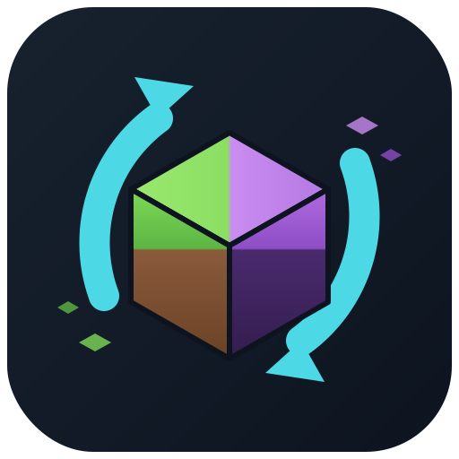

<p align="center">
  
</p>

# World Switcher

Server-side-only NeoForge 1.21.1 mod for running multiple worlds on one server, Multiverse-style:
switch between them with a command, import existing world saves from a folder, and keep a separate
player state (inventory & more) per world.

**No client mod needed** — vanilla 1.21.1 clients can join. The mod registers no items, blocks or
network payloads; custom worlds use the vanilla `minecraft:overworld` dimension type with a
`worldswitcher:*` dimension key, which vanilla clients accept.

## Commands

### `/ws <world>` — switch world

Allowed for all players by default (`wsPermissionLevel` config). `default` is the vanilla world
group (overworld/nether/end) and always available. Tab completion lists all worlds.

### `/wsc <action>` — world management (OP level 2+)

| Action | Description |
|---|---|
| `list` | All worlds with load state and player counts (names clickable → `/ws`) |
| `info <world>` | Seed, spawn, folder, disk size, import origin |
| `create <name> [seed]` | Create a fresh world (random seed if omitted) |
| `import <source> [as <name>]` | Copy a world save from the worlds folder (subpaths need quotes: `"backups/old"`) |
| `rename <world> <newName>` | Rename — inventories, spawns and the world folder are untouched |
| `load` / `unload <world>` | Load/unload at runtime; unload moves players to the default spawn |
| `tp <player> <world>` | Switch another player |
| `gamerule <world> [<rule> [value]]` | Per-world game rules; without a rule, lists this world's overrides |
| `delete <world>` | Delete world + data + stored inventories (asks for confirmation) |

### Per-world game rules, time and weather

Every managed world has its own game rules, day time and weather (config `perWorldGameRules` /
`perWorldTimeAndWeather`). The vanilla `/gamerule`, `/time` and `/weather` commands are
context-sensitive: executed **inside a managed world** they change only that world, executed in
the vanilla dimensions they behave exactly like vanilla (global). To target a world from
anywhere: `/wsc gamerule <world> …` or `/execute in worldswitcher:<id> run time|weather|gamerule …`.

- New worlds start with a copy of the current global rules and the overworld's clock; imported
  worlds keep the day time and game rules from their `level.dat`.
- `doDaylightCycle`/`doWeatherCycle` work per world (frozen clock, eternal rain, …). Sleeping
  skips only that world's night.
- Still global by nature: `sendCommandFeedback`, `logAdminCommands`, `spawnChunkRadius`.
- Works with modded rules too — e.g. Serene Seasons' `doSeasonCycle` (see below).

### Serene Seasons

[Serene Seasons](https://modrinth.com/mod/serene-seasons) already keeps its season progress per
dimension, so it combines nicely: add your world to `whitelisted_dimensions` in
`config/sereneseasons/seasons.toml` (e.g. `"worldswitcher:creative"`) and it gets its own season
state; `doSeasonCycle` can be toggled per world like any other rule.

### Importing worlds

Put world save folders (the folder containing `level.dat`) into `<server>/worlds/` — directly or
in subfolders. `/wsc import` copies **only the overworld data** (`region`, `entities`, `poi`,
`data`) into the server save under `dimensions/worldswitcher/<id>/`; the source folder is never
modified. Seed and spawn are read from `level.dat`, so terrain keeps generating correctly beyond
the pre-generated area. Old worlds (e.g. 1.18) are upgraded chunk-by-chunk on first visit —
expect brief lag spikes in old regions.

Stop the source server before importing a live world (a fresh `session.lock` triggers a warning).

## Per-world player state

With `separateInventories = true` (default), each world keeps its own player state per player:
inventory, ender chest, XP, health, hunger, potion effects and last position. The vanilla
dimensions count as one group `default`. First visit to a world = fresh start at its spawn.

Handled edge cases:

- **Nether portals inside the default group** don't swap anything.
- **Portals that cross world groups** (e.g. a nether portal built in an imported world) swap the
  state like `/ws` would (`handlePortalGroupChanges`; set to `false` to block such travel).
- **Death in world X without a bed there** respawns you in the default world with your default
  state; world X keeps the post-death state (your items drop at the death spot as usual).
- **World deleted/unloaded while you were offline in it**: on login you're reconciled into the
  overworld with your default state.

## Config (`world/serverconfig/worldswitcher-server.toml`)

| Option | Default | Description |
|---|---|---|
| `separateInventories` | `true` | Per-world player state |
| `wsPermissionLevel` | `0` | Permission level for `/ws` (0 = everyone) |
| `worldsFolder` | `worlds` | Import container folder (relative to server root) |
| `autoLoadOnStartup` | `true` | Re-load registered worlds at server start |
| `restoreLastPosition` | `true` | `/ws` returns you to your last position in that world |
| `swapGamemode` | `true` | Game mode is part of the per-world state (first visit keeps the current one) |
| `handlePortalGroupChanges` | `true` | Swap state on cross-group portal travel (else cancel it) |
| `importCopyAsync` | `true` | Copy imports on a background thread |
| `perWorldGameRules` | `true` | Each world keeps its own game rules |
| `perWorldTimeAndWeather` | `true` | Each world keeps its own day time and weather |

## Known behavior

- With `perWorldGameRules`/`perWorldTimeAndWeather` disabled, game rules, time and weather are
  shared across all worlds (derived from the overworld, like the vanilla nether/end).
- Custom worlds don't appear in `level.dat`'s world-gen settings; they are tracked in
  `world/data/worldswitcher_worlds.dat` and recreated at startup.
- Other mods that iterate all levels (maps like BlueMap, etc.) will see the custom worlds and may
  need their own per-dimension config.
- `/execute in worldswitcher:<id> run ...` works as usual — handy for debugging.

## Building

```
./gradlew build          # jar lands in build/libs/ and is auto-copied to test-server/mods/
```

NeoForge 21.0.167, Minecraft 1.21.1, Java 21, Gradle 8.14.3. The `test-server/` folder holds a
local dedicated server for manual testing (not committed; install NeoForge there with
`java -jar neoforge-installer.jar --install-server .`).
